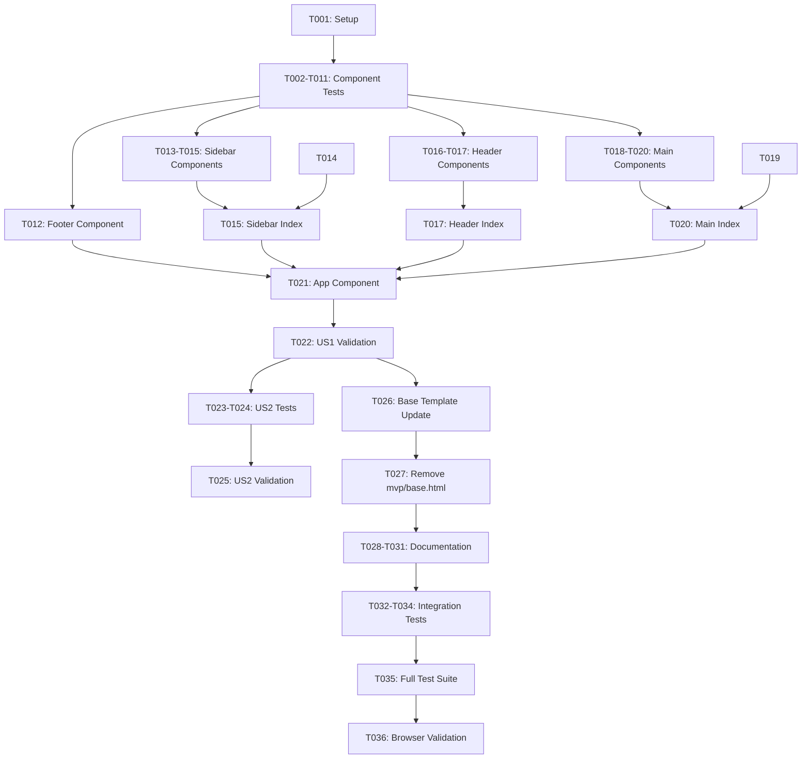

# Implementation Tasks: AdminLTE Layout Component Separation

**Feature**: 001-layout-component-split
**Branch**: `001-layout-component-split`
**Plan**: [plan.md](./plan.md) | **Spec**: [spec.md](./spec.md)
**Updated**: 2026-01-06

## Task Summary

- **Total Tasks**: 36
- **Setup**: 1 task
- **Foundational**: 0 tasks (components already partially exist)
- **User Story 1** (Component Isolation - P1): 21 tasks
- **User Story 2** (Composition Flexibility - P2): 3 tasks
- **Base Template Update**: 2 tasks
- **Documentation**: 4 tasks
- **Testing & Validation**: 5 tasks

## Implementation Strategy

**Status**: Ready for implementation

**Test-First Approach**: Following Django MVP constitution, tests will be written before implementation for each component.

**Component Creation Order**: Bottom-up approach - create sub-components before orchestrators to enable incremental testing.

---

## Phase 1: Setup

### Environment Setup

- [ ] T001 Verify pytest-django test environment configured in tests/settings.py and conftest.py

---

## Phase 2: User Story 1 - Component Isolation and Reusability (P1)

**Goal**: Split AdminLTE layout into 5 separate Cotton components enabling independent customization

**Independent Test Criteria**: Each component can be rendered independently with render_component() and produces correct HTML structure with appropriate CSS classes.

### Tests

- [ ] T002 [P] [US1] Write test for app component renders .app-wrapper div in tests/test_app_components.py
- [ ] T003 [P] [US1] Write test for header/index.html renders .app-header with navbar structure in tests/test_app_components.py
- [ ] T004 [P] [US1] Write test for header/toggle.html renders sidebar toggle button in tests/test_app_components.py
- [ ] T005 [P] [US1] Write test for sidebar/index.html renders .app-sidebar with slots in tests/test_app_components.py
- [ ] T006 [P] [US1] Write test for sidebar/branding.html renders brand logo/text in tests/test_app_components.py
- [ ] T007 [P] [US1] Write test for sidebar/menu.html renders navigation wrapper in tests/test_app_components.py
- [ ] T008 [P] [US1] Write test for main/index.html renders .app-main structure in tests/test_app_components.py
- [ ] T009 [P] [US1] Write test for main/content_header.html renders .app-content-header in tests/test_app_components.py
- [ ] T010 [P] [US1] Write test for main/content.html renders .app-content wrapper in tests/test_app_components.py
- [ ] T011 [P] [US1] Write test for footer.html renders .app-footer with slot content in tests/test_app_components.py

### Implementation

- [ ] T012 [US1] Create mvp/templates/cotton/app/footer.html with c-vars (text, class) and default slot (validates FR-007)
- [ ] T013 [P] [US1] Create mvp/templates/cotton/app/sidebar/branding.html with c-vars (brand_text, brand_logo, brand_url) (validates FR-005)
- [ ] T014 [P] [US1] Create mvp/templates/cotton/app/sidebar/menu.html with default slot for menu items (validates FR-005)
- [ ] T015 [P] [US1] Create mvp/templates/cotton/app/sidebar/index.html composing branding + menu with c-vars (class, theme) (validates FR-005)
- [ ] T016 [P] [US1] Create mvp/templates/cotton/app/header/toggle.html rendering sidebar toggle button (validates FR-004)
- [ ] T017 [P] [US1] Create mvp/templates/cotton/app/header/index.html with navbar structure, toggle component, and left/right slots (validates FR-004)
- [ ] T018 [P] [US1] Create mvp/templates/cotton/app/main/content_header.html with container-fluid and slot (validates FR-006)
- [ ] T019 [P] [US1] Create mvp/templates/cotton/app/main/content.html with .app-content wrapper and slot (validates FR-006)
- [ ] T020 [P] [US1] Create mvp/templates/cotton/app/main/index.html composing content_header + content with c-vars (show_header, container_class) (validates FR-006)
- [ ] T021 [US1] Create mvp/templates/cotton/app/index.html with .app-wrapper grid, default slot, and c-vars (fixed_sidebar, fixed_header, fixed_footer, sidebar_expand, class) (validates FR-001, FR-003)
- [ ] T022 [US1] Run all User Story 1 tests and verify components render independently (validates SC-001, SC-003)

---

## Phase 3: User Story 2 - Component Composition Flexibility (P2)

**Goal**: Enable developers to compose custom layouts using any combination of components

**Independent Test Criteria**: Templates can selectively include/exclude components and render without errors.

### Tests

- [ ] T023 [P] [US2] Write test for template with only app + header + main (no sidebar/footer) renders correctly in tests/test_base_template.py
- [ ] T024 [P] [US2] Write test for template overriding app block with custom component composition in tests/test_base_template.py

### Implementation

- [ ] T025 [US2] Verify dashboard.html in example/templates/example/ uses all 5 components with various configurations (validates FR-002, SC-004)

---

## Phase 4: Base Template Update

**Goal**: Update base.html to use new component structure with default layout

### Implementation

- [ ] T026 [Base] Update mvp/templates/base.html to define default 5-component layout in app block (validates FR-010)
- [ ] T027 [Base] Remove mvp/templates/mvp/base.html (consolidated into base.html per spec clarification)

---

## Phase 5: Documentation

### Component Documentation

- [ ] T028 [P] Document app component c-vars and slots in docs/components/app.md (if not already complete)
- [ ] T029 [P] Document header, sidebar, main, footer components in docs/components/ with c-vars, slots, and usage examples

### Project Documentation

- [ ] T030 Add component separation section to README.md with quickstart example showing base.html extension pattern
- [ ] T031 Update CHANGELOG.md with component separation feature documentation

---

## Phase 6: Testing & Validation

### Integration Testing

- [ ] T032 Write integration test verifying base.html renders all 5 components in tests/test_base_template.py
- [ ] T033 Write test for custom layout overriding app block in tests/test_base_template.py
- [ ] T034 Verify all AdminLTE CSS classes preserved (validates FR-009)

### Final Validation

- [ ] T035 Run full test suite: poetry run pytest
- [ ] T036 Verify components work in multiple browsers (Chrome, Firefox, Safari, Edge) - validates SC-002

---

## Task Dependencies



## Parallel Execution Opportunities

### User Story 1 - Component Tests (After T001)

These test tasks can be executed in parallel:

- T002: App component test
- T003: Header index test
- T004: Header toggle test
- T005: Sidebar index test
- T006: Sidebar branding test
- T007: Sidebar menu test
- T008: Main index test
- T009: Main content_header test
- T010: Main content test
- T011: Footer test

### User Story 1 - Component Creation (After Tests Written)

**Batch 1 - Leaf Components** (no dependencies):

- T012: Footer
- T013: Sidebar Branding
- T014: Sidebar Menu
- T016: Header Toggle
- T018: Main Content Header
- T019: Main Content

**Batch 2 - Orchestrator Components** (after Batch 1):

- T015: Sidebar Index (depends on T013, T014)
- T017: Header Index (depends on T016)
- T020: Main Index (depends on T018, T019)

**Batch 3 - Top Component** (after Batch 2):

- T021: App Component (depends on T012, T015, T017, T020)

### User Story 2 - Tests (After T022)

These tasks can be executed in parallel:

- T023: Composition test
- T024: Override test

### Documentation (After T027)

These tasks can be executed in parallel:

- T028: App component docs
- T029: Other component docs
- T030: README update
- T031: CHANGELOG update

### Integration Tests (After T031)

These tasks can be executed in parallel:

- T032: Base template integration test
- T033: Custom layout test
- T034: CSS classes verification

## Implementation Notes

**Test-First Workflow**:

1. Write all component tests first (T002-T011)
2. Observe tests fail
3. Implement components in bottom-up order (T012-T021)
4. Verify tests pass

**Component Testing Pattern**:

```python
# Use django-cotton's render_component helper
from django_cotton import render_component

def test_component_renders(rf):
    request = rf.get("/")
    html = render_component(request, "app/footer", text="© 2026")
    assert "© 2026" in html
    assert 'class="app-footer' in html
```

**Cotton Component Structure**:

```django
<c-vars attribute_name="default_value" />
<element class="css-class {{ class }}">
  {{ slot }}
</element>
```

**Critical Path**: T001 → T002-T011 → T012-T021 → T022 → T026 → T027 → T035 → T036

All tasks on critical path must complete sequentially. Parallel opportunities exist within test writing (T002-T011) and component creation batches.

## MVP Scope

For fastest delivery, focus on critical path tasks only:

- **Phase 1**: T001 (Setup)
- **Phase 2**: T002-T022 (All US1 tasks - core component creation)
- **Phase 4**: T026-T027 (Base template update)
- **Phase 6**: T035 (Test suite validation)

This delivers the core component separation functionality. Documentation (T028-T031), US2 validation (T023-T025), and integration tests (T032-T034) can be completed in subsequent iterations.
