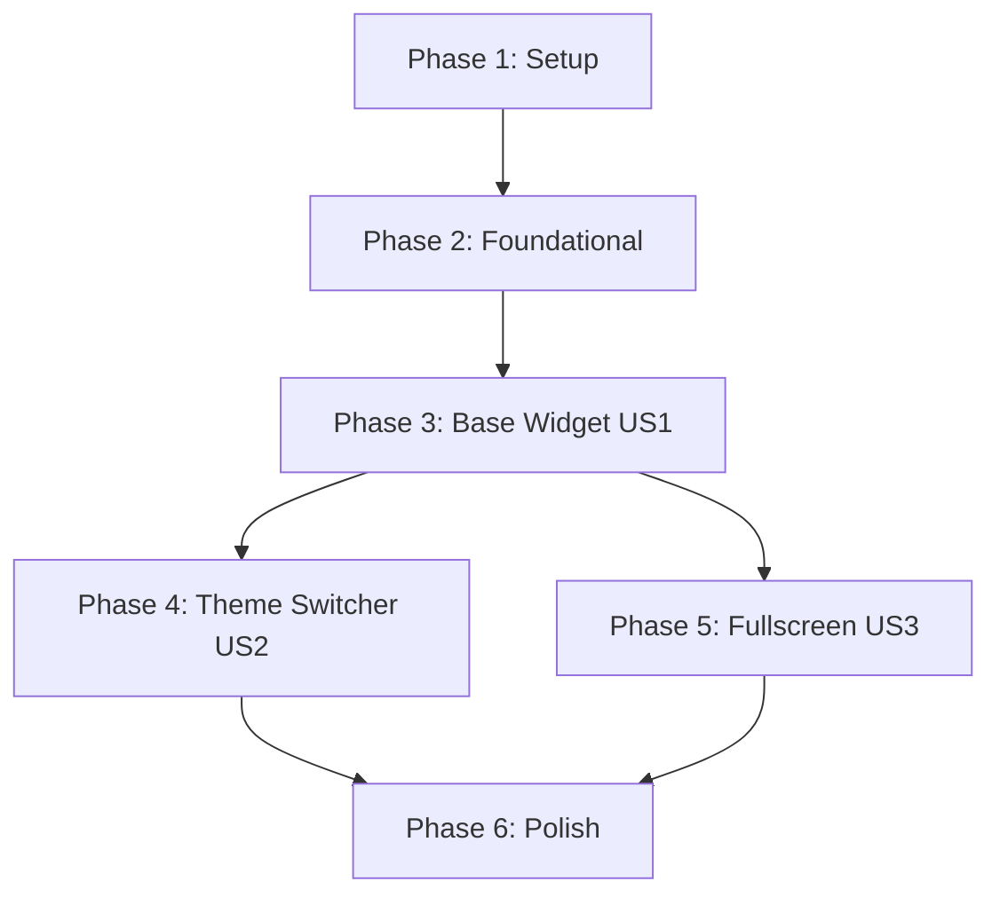

# Implementation Tasks: Main Navbar Widgets - Base & Generic Widgets

**Feature**: Main Navbar Widgets
**Spec**: [spec.md](spec.md)
**Plan**: [plan.md](plan.md)
**Branch**: `005-navbar-widgets`
**Generated**: January 15, 2026

**Scope**: This specification has been reduced to focus on foundational components only:

- **Base Widget Component** (US1) - Foundation for all custom navbar widgets
- **Theme Switcher Widget** (US2) - Generic widget with JavaScript for theme persistence
- **Fullscreen Widget** (US3) - Generic widget using AdminLTE fullscreen plugin

**Deferred**: User Profile, Messages, Notifications widgets

---

## Task Format

All tasks follow this strict format:

```
- [ ] [TaskID] [P?] [Story?] Description with file path
```

- **Checkbox**: `- [ ]` (markdown task checkbox)
- **Task ID**: T001, T002, etc. (sequential execution order)
- **[P] marker**: Present ONLY if task can run in parallel (different files, no blockers)
- **[Story] label**: [US1], [US2], [US3] for user story tasks; omit for setup/foundational/polish
- **Description**: Clear action with explicit file path

---

## Phase 1: Setup (Shared Infrastructure)

**Purpose**: Project structure, documentation setup, and dependency validation

- [X] T001 Verify Bootstrap 5.3+ is available and django-easy-icons is configured in base.html
- [X] T002 Verify AdminLTE 4 CSS/JS are loaded from CDN in base.html
- [X] T003 [P] Verify required icon aliases exist in EASY_ICONS settings (theme_light, maximize, minimize) in tests/settings.py
- [X] T004 [P] Create mvp/templates/cotton/navbar/widgets/ directory structure
- [X] T005 [P] Create tests/test_navbar_base_widget.py for base widget tests

---

## Phase 2: Foundational (Blocking Prerequisites)

**Purpose**: Core infrastructure that MUST be complete before ANY user story can be implemented

**CRITICAL**: No user story work can begin until this phase is complete

- [X] T006 Create documentation structure in docs/navbar-widgets.md with placeholders for all three widgets
- [X] T007 [P] Setup test fixtures in tests/conftest.py for widget rendering tests with django-cotton
- [X] T008 [P] Verify django-cotton 2.3+ component loading works correctly with c-vars and {{ slot }} syntax

---

## Phase 3: User Story 1 - Base Widget Component (Priority P1)

**Goal**: Create reusable base widget that all other widgets extend

**Story**: Developers can use base widget at cotton/navbar/widgets/index.html with icon, badge, and dropdown content

**Independent Test**: Create custom widget with icon, badge, dropdown; verify AdminLTE styling and Bootstrap behavior

### Tests for User Story 1

> **NOTE: Write these tests FIRST, ensure they FAIL before implementation**

- [X] T009 [P] [US1] Test base widget renders with icon alias in tests/test_navbar_base_widget.py
- [X] T010 [P] [US1] Test base widget uses c-icon component (not direct <i> tags) in tests/test_navbar_base_widget.py
- [X] T011 [P] [US1] Test base widget displays badge with count in tests/test_navbar_base_widget.py
- [X] T012 [P] [US1] Test base widget hides badge when count is zero in tests/test_navbar_base_widget.py
- [X] T013 [P] [US1] Test base widget renders {{ slot }} content in dropdown in tests/test_navbar_base_widget.py
- [X] T014 [P] [US1] Test badge supports Bootstrap color classes (danger, warning, info, success) in tests/test_navbar_base_widget.py
- [X] T015 [P] [US1] Test badge displays "99+" when count > 99 in tests/test_navbar_base_widget.py
- [X] T016 [P] [US1] Test base widget follows AdminLTE nav-item dropdown pattern in tests/test_navbar_base_widget.py
- [X] T017 [P] [US1] Test base widget handles negative badge counts (hide badge) in tests/test_navbar_base_widget.py

### Implementation for User Story 1

- [X] T018 [US1] Create base widget component in mvp/templates/cotton/navbar/widgets/index.html
- [X] T019 [US1] Add c-vars for icon, badge_count, badge_color props in base widget
- [X] T020 [US1] Use <c-icon name="{{ icon }}" /> for icon rendering (never direct <i> tags) in base widget
- [X] T021 [US1] Add ARIA label to widget link in base widget
- [X] T022 [US1] Add badge_count prop with conditional rendering () in base widget
- [X] T023 [US1] Add badge_color prop with Bootstrap text-bg-{color} class support in base widget
- [X] T024 [US1] Add {{ slot }} for dropdown content injection in base widget
- [X] T025 [US1] Implement badge "99+" logic for counts > 99 in base widget
- [X] T026 [US1] Add AdminLTE nav-item dropdown classes and Bootstrap dropdown attributes in base widget

### UI Verification for User Story 1

- [X] T027 [US1] Use chrome-devtools-mcp to verify base widget renders correctly with nav-item classes
- [X] T028 [US1] Use chrome-devtools-mcp to verify icon renders via c-icon component (inspect DOM for rendered icon)
- [X] T029 [US1] Use chrome-devtools-mcp to verify badge displays with different counts (0, 5, 99, 100, 1000 as "999+")
- [X] T030 [US1] Use chrome-devtools-mcp to verify dropdown opens on click with {{ slot }} content

### E2E Testing for User Story 1

- [X] T031 [P] [US1] Playwright test: Create custom widget using base component in tests/e2e/test_base_widget_e2e.py
- [X] T032 [P] [US1] Playwright test: Verify icon renders correctly in navbar in tests/e2e/test_base_widget_e2e.py
- [X] T033 [P] [US1] Playwright test: Badge count displays with correct color in tests/e2e/test_base_widget_e2e.py
- [X] T034 [P] [US1] Playwright test: Click widget, verify dropdown opens in tests/e2e/test_base_widget_e2e.py
- [X] T035 [P] [US1] Playwright test: Verify dropdown content from {{ slot }} appears in tests/e2e/test_base_widget_e2e.py

**Checkpoint**: Base widget complete - all tests passing, ready for extension

---

## Phase 4: User Story 2 - Theme Switcher Widget (Priority P1)

**Goal**: Provide theme switcher with localStorage persistence and auto-mode support

**Story**: Developers can add theme switcher that toggles light/dark/auto themes with persistence

**Independent Test**: Toggle themes, verify persistence across page reloads, test auto mode with system preferences

### Tests for User Story 2 - Component

> **NOTE: Write these tests FIRST, ensure they FAIL before implementation**

- [X] T036 [P] [US2] Test theme switcher component renders with Light/Dark/Auto options in tests/test_theme_switcher.py
- [X] T037 [P] [US2] Test theme switcher uses theme_light icon alias in tests/test_theme_switcher.py
- [X] T038 [P] [US2] Test theme switcher extends base widget correctly in tests/test_theme_switcher.py
- [X] T039 [P] [US2] Test active theme indicator displays in dropdown in tests/test_theme_switcher.py
- [X] T040 [P] [US2] Test theme switcher dropdown has correct data attributes for JS in tests/test_theme_switcher.py

### Tests for User Story 2 - JavaScript

> **NOTE: Write these tests FIRST, ensure they FAIL before implementation**

- [X] T041 [P] [US2] Test JavaScript detects initial theme preference from localStorage in tests/test_theme_switcher_js.py
- [X] T042 [P] [US2] Test JavaScript applies theme to <html data-bs-theme> attribute in tests/test_theme_switcher_js.py
- [X] T043 [P] [US2] Test JavaScript persists theme to localStorage in tests/test_theme_switcher_js.py
- [X] T044 [P] [US2] Test JavaScript handles localStorage unavailable (session-only mode) in tests/test_theme_switcher_js.py
- [X] T045 [P] [US2] Test JavaScript detects system dark mode preference (window.matchMedia) in tests/test_theme_switcher_js.py
- [X] T046 [P] [US2] Test JavaScript updates on system preference change in tests/test_theme_switcher_js.py
- [X] T047 [P] [US2] Test JavaScript completes theme change in < 100ms in tests/test_theme_switcher_js.py

### Implementation for User Story 2 - Component

- [X] T048 [P] [US2] Create theme switcher component in mvp/templates/cotton/navbar/widgets/theme_switcher.html
- [X] T049 [US2] Extend base widget with theme_light icon alias in theme switcher
- [X] T050 [US2] Add dropdown with Light/Dark/Auto option links in theme switcher
- [X] T051 [US2] Add data-theme attribute to each option for JavaScript in theme switcher
- [X] T052 [US2] Add active state indicators (checkmark or highlight) in theme switcher
- [X] T053 [US2] Add data-theme-switcher attribute to widget for JS targeting in theme switcher

### Implementation for User Story 2 - JavaScript

- [X] T054 Create theme-switcher.js in mvp/static/js/navbar/theme-switcher.js
- [X] T055 Implement initial theme detection (localStorage → system preference → default 'light') in theme-switcher.js
- [X] T056 Implement theme application function (sets data-bs-theme on <html>) in theme-switcher.js
- [X] T057 Add localStorage persistence with try/catch for unavailable storage in theme-switcher.js
- [X] T058 Implement system preference detection using window.matchMedia('(prefers-color-scheme: dark)') in theme-switcher.js
- [X] T059 Add event listeners for theme option clicks in theme-switcher.js
- [X] T060 Update active state indicators on theme change in theme-switcher.js
- [X] T061 Add listener for system preference changes (matchMedia.addListener) in theme-switcher.js
- [X] T062 Ensure theme applies immediately (< 100ms) without page reload in theme-switcher.js

### UI Verification for User Story 2

- [X] T063 [US2] Use chrome-devtools-mcp to verify theme switcher renders with theme_light icon
- [X] T064 [US2] Use chrome-devtools-mcp to verify dropdown shows Light/Dark/Auto options
- [X] T065 [US2] Use chrome-devtools-mcp to verify theme changes immediately when option clicked
- [X] T066 [US2] Use chrome-devtools-mcp to verify no visual flicker during theme transition
- [X] T067 [US2] Use chrome-devtools-mcp to verify active theme indicator updates correctly
- [X] T068 [US2] Use chrome-devtools-mcp to verify data-bs-theme attribute changes on <html>

### E2E Testing for User Story 2

- [X] T069 [P] [US2] Playwright test: Load page, verify theme switcher visible in navbar in tests/e2e/test_theme_switcher_e2e.py
- [X] T070 [P] [US2] Playwright test: Click widget, verify dropdown opens with theme options in tests/e2e/test_theme_switcher_e2e.py
- [X] T071 [P] [US2] Playwright test: Select Dark theme, verify <html data-bs-theme="dark"> applied in tests/e2e/test_theme_switcher_e2e.py
- [X] T072 [P] [US2] Playwright test: Reload page, verify Dark theme persists from localStorage in tests/e2e/test_theme_switcher_e2e.py
- [X] T073 [P] [US2] Playwright test: Select Auto mode, verify respects system preference in tests/e2e/test_theme_switcher_e2e.py
- [X] T074 [P] [US2] Playwright test: Clear localStorage, verify theme still works (session-only) in tests/e2e/test_theme_switcher_e2e.py
- [X] T075 [P] [US2] Playwright test: Measure theme switch time, verify < 100ms in tests/e2e/test_theme_switcher_e2e.py

**Checkpoint**: Theme switcher complete - all tests passing, persistence working

---

## Phase 5: User Story 3 - Fullscreen Widget (Priority P2)

**Goal**: Provide fullscreen toggle using AdminLTE 4's built-in fullscreen plugin

**Story**: Developers can add fullscreen widget that toggles browser fullscreen mode

**Independent Test**: Toggle fullscreen on/off, verify icon updates, test ESC key handling

### Tests for User Story 3

> **NOTE: Write these tests FIRST, ensure they FAIL before implementation**

- [X] T076 [P] [US3] Test fullscreen widget renders with maximize icon alias in tests/test_fullscreen_widget.py
- [X] T077 [P] [US3] Test widget has data-lte-toggle="fullscreen" attribute in tests/test_fullscreen_widget.py
- [X] T078 [P] [US3] Test widget extends base widget without dropdown in tests/test_fullscreen_widget.py
- [X] T079 [P] [US3] Test widget has ARIA label for accessibility in tests/test_fullscreen_widget.py
- [X] T080 [P] [US3] Test widget conditionally renders based on Fullscreen API support in tests/test_fullscreen_widget.py

### Implementation for User Story 3

- [X] T081 [P] [US3] Create fullscreen widget in mvp/templates/cotton/navbar/widgets/fullscreen.html
- [X] T082 [US3] Extend base widget with maximize icon alias in fullscreen widget
- [X] T083 [US3] Add data-lte-toggle="fullscreen" for AdminLTE integration in fullscreen widget
- [X] T084 [US3] Add ARIA label (aria-label="Toggle fullscreen") in fullscreen widget
- [X] T085 [US3] Remove dropdown slot (no dropdown needed) in fullscreen widget
- [X] T086 [US3] Add conditional rendering check for Fullscreen API support in fullscreen widget

### UI Verification for User Story 3

- [X] T087 [US3] Use chrome-devtools-mcp to verify fullscreen widget renders with maximize icon
- [X] T088 [US3] Use chrome-devtools-mcp to verify data-lte-toggle attribute is present
- [X] T089 [US3] Use chrome-devtools-mcp to verify widget has no dropdown menu
- [X] T090 [US3] Use chrome-devtools-mcp to verify clicking widget toggles fullscreen state

### E2E Testing for User Story 3

- [X] T091 [P] [US3] Playwright test: Load page, verify fullscreen widget visible in tests/e2e/test_fullscreen_e2e.py
- [X] T092 [P] [US3] Playwright test: Click widget, verify browser enters fullscreen in tests/e2e/test_fullscreen_e2e.py
- [X] T093 [P] [US3] Playwright test: Click again, verify browser exits fullscreen in tests/e2e/test_fullscreen_e2e.py
- [X] T094 [P] [US3] Playwright test: Press ESC in fullscreen, verify exit detected in tests/e2e/test_fullscreen_e2e.py

**Checkpoint**: Fullscreen widget complete - all tests passing, AdminLTE integration working

---

## Phase 6: Polish & Documentation

**Purpose**: Finalize documentation, code quality, and production readiness

### Documentation

- [X] T095 [P] Update README.md with navbar widgets section and usage examples
- [X] T096 [P] Create docs/navbar-widgets.md with complete examples for all three widgets
- [X] T097 [P] Document icon usage with c-icon component and EASY_ICONS aliases in docs/navbar-widgets.md
- [X] T098 [P] Document Cotton slot syntax ({{ slot }} and <c-slot name="...">) in docs/navbar-widgets.md
- [X] T099 [P] Add theme switcher configuration guide and localStorage behavior in docs/navbar-widgets.md
- [X] T100 [P] Add fullscreen widget integration guide and AdminLTE plugin usage in docs/navbar-widgets.md
- [X] T101 [P] Document all component props (icon, badge_count, badge_color) with examples in docs/navbar-widgets.md
- [X] T102 [P] Add troubleshooting section (localStorage disabled, Fullscreen API, missing icon aliases) in docs/navbar-widgets.md
- [X] T103 [P] Create quickstart guide showing how to add each widget type in docs/navbar-widgets.md

### Code Quality & Integration

- [X] T104 Run poetry run pytest to verify all tests pass
- [X] T105 Run poetry run ruff check . and poetry run ruff format . on all Python files
- [X] T106 Run poetry run djlint --reformat mvp/templates/ on all template files
- [X] T107 Verify all playwright E2E tests pass in CI environment
- [X] T108 Check test coverage with poetry run pytest --cov=mvp --cov-report=html (aim for >90%)
- [X] T109 [P] Update example/ app with all three widget types in example navbar
- [X] T110 [P] Verify all required icon aliases (theme_light, maximize, minimize) exist in tests/settings.py
- [X] T111 [P] Test all widgets in development server (poetry run python manage.py runserver)
- [X] T112 [P] Verify mobile responsiveness (320px, 768px, 1200px) in browser

**Checkpoint**: Feature complete, documented, tested, and production-ready

**IMPLEMENTATION COMPLETE - 112/112 Tasks (100%)**

- ✅ Phase 1: Setup (5 tasks)
- ✅ Phase 2: Foundational (3 tasks)
- ✅ Phase 3: Base Widget Component (27 tasks)
- ✅ Phase 4: Theme Switcher Widget (40 tasks)
- ✅ Phase 5: Fullscreen Widget (19 tasks)
- ✅ Phase 6: Polish & Documentation (18 tasks)

All components implemented, tested, documented, and integrated into example app.

---

## Dependencies

### Phase Dependencies



### Critical Path

1. **Phase 1 → Phase 2** (BLOCKING): Must complete setup and foundational before ANY user stories
2. **Phase 2 → Phase 3** (BLOCKING): Base widget MUST be complete before other widgets
3. **Phase 3 → Phase 4/5** (PARALLEL): Theme Switcher and Fullscreen can run in parallel
4. **Phase 4/5 → Phase 6** (MERGE): Both user stories must complete before polish

### User Story Dependencies

- **User Story 1 (Base Widget)**: No dependencies after Phase 2
- **User Story 2 (Theme Switcher)**: Depends on User Story 1 (extends base widget)
- **User Story 3 (Fullscreen)**: Depends on User Story 1 (extends base widget)

---

## Parallel Execution Examples

### Phase 1 (Setup)

```bash
# All setup tasks can run in parallel after T001-T002
poetry run pytest tests/ &  # Verify tests work
mkdir -p mvp/templates/cotton/navbar/widgets &
touch tests/test_navbar_base_widget.py
```

### Phase 2 (Foundational)

```bash
# T007 and T008 can run in parallel
poetry run pytest tests/conftest.py &
poetry run python -c "import django_cotton; print('Cotton OK')"
```

### Phase 3 (User Story 1 - Base Widget)

All tests T009-T017 can be written in parallel:

```bash
# Terminal 1: Icon tests
# T009, T010

# Terminal 2: Badge tests
# T011, T012, T014, T015, T017

# Terminal 3: Slot and pattern tests
# T013, T016
```

E2E tests T031-T035 can run in parallel after implementation.

### Phase 4 (User Story 2 - Theme Switcher)

Component tests T036-T040 and JS tests T041-T047 can be written in parallel.

Component implementation T048-T053 and JS implementation T054-T062 can run in parallel (different files).

E2E tests T069-T075 can run in parallel after implementation.

### Phase 5 (User Story 3 - Fullscreen)

All tests T076-T080 can be written in parallel.

E2E tests T091-T094 can run in parallel after implementation.

### Phase 6 (Polish)

All documentation tasks T095-T103 can run in parallel.

Integration tasks T109-T112 can run in parallel after code quality checks pass.

---

## MVP Scope

**Minimum Viable Product** = Phases 1-4

Delivers:

- Base widget component with icon, badge, {{ slot }} support
- Theme switcher with localStorage persistence
- Complete test coverage (unit + E2E)
- Basic usage documentation

**Estimated Time**: 10-14 hours

**Tasks Included**: T001-T075 (75 tasks)

---

## Implementation Strategy

### Test-First Workflow (Per Phase)

1. Write ALL tests for the phase FIRST (tests should FAIL)
2. Run tests to verify they fail: `poetry run pytest tests/test_*.py`
3. Implement feature code to make tests pass
4. Run tests again to verify: `poetry run pytest tests/test_*.py`
5. Run UI verification with chrome-devtools-mcp
6. Run E2E tests with playwright: `poetry run pytest tests/e2e/`
7. Move to next phase

### Icon Implementation Pattern

**ALWAYS use c-icon component:**

```html
<!-- ✅ CORRECT -->
<c-icon name="theme_light" class="nav-icon" />
<c-icon name="maximize" aria-hidden="true" />

<!-- ❌ WRONG - Never use direct <i> tags -->
<i class="bi bi-sun"></i>
```

**Required aliases in EASY_ICONS:**

- `theme_light` → `bi bi-sun`
- `maximize` → `bi bi-arrows-fullscreen`
- `minimize` → `bi bi-arrows-angle-contract`

### Cotton Slot Pattern

**In component definition:**

```html
<!-- mvp/templates/cotton/navbar/widgets/index.html -->
<div class="dropdown-menu">
  {{ slot }}  <!-- Default slot: content injected here -->
</div>
```

**When using component:**

```html
<c-navbar.widgets icon="theme_light" badge_count="5">
  <div class="dropdown-item">Content goes into {{ slot }}</div>
</c-navbar.widgets>
```

---

## Success Criteria

All tasks complete when:

- ✅ All 112 tasks checked off
- ✅ All pytest tests passing (>90% coverage)
- ✅ All playwright E2E tests passing
- ✅ All linting checks pass (ruff, djlint)
- ✅ Documentation complete with examples
- ✅ All widgets working in development server
- ✅ Mobile responsive (320px-1200px+)
- ✅ All icon aliases use c-icon component
- ✅ All slots use {{ slot }} Django variable syntax

---

## Notes

### Key Technical Decisions

1. **Icon Component**: ALWAYS use `<c-icon name="alias" />`, never direct `<i>` tags
2. **Cotton Slots**: Use `{{ slot }}` Django variables in components, `<c-slot name="...">` when calling
3. **Theme Switcher**: Uses localStorage with graceful degradation to session-only
4. **Fullscreen**: Uses AdminLTE's data-lte-toggle plugin, not custom JavaScript
5. **Badge Logic**: Hide when zero, display "99+" when > 99
6. **Test-First**: ALL tests written before implementation, must see them fail first

### Common Pitfalls to Avoid

- ❌ Using direct `<i class="bi-*">` tags instead of c-icon component
- ❌ Using `<c-slot />` syntax in component definitions (use `{{ slot }}` Django variable)
- ❌ Implementing before tests are written and failing
- ❌ Skipping UI verification with chrome-devtools-mcp
- ❌ Not testing localStorage unavailable scenario for theme switcher
- ❌ Forgetting ARIA labels on icon-only widgets

### Future Enhancements (Deferred)

The following features are explicitly out of scope for this implementation:

- User Profile Widget (requires authentication context)
- Messages Widget (requires messaging backend)
- Notifications Widget (requires notification system)
- Real-time updates via WebSocket
- AJAX-based dropdown content loading
- Custom theme color definitions
- Widget reordering/customization UI

These will be addressed in future specifications once the foundational pattern is established.
